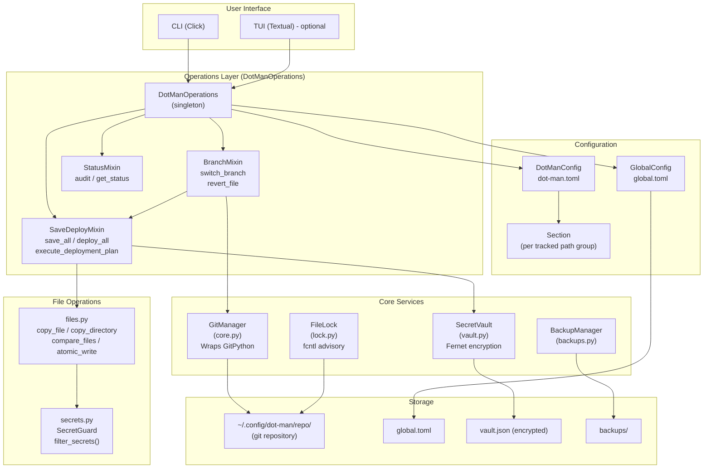
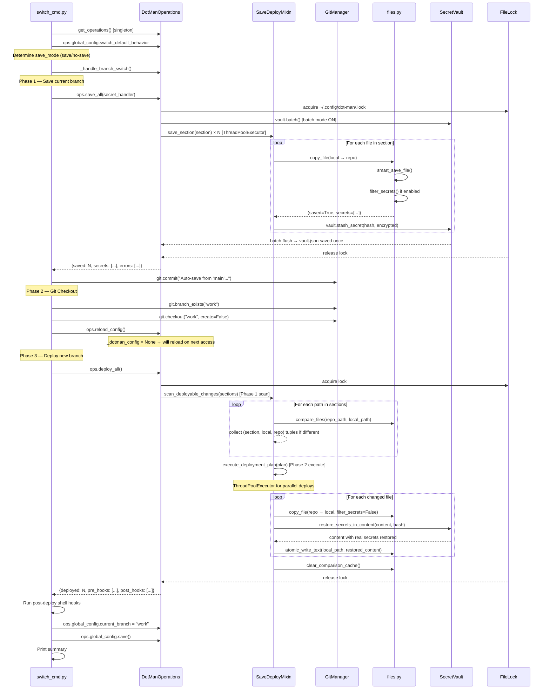
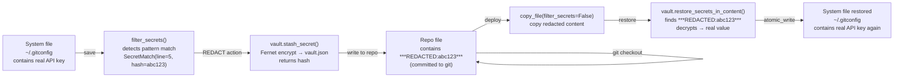

# dot-man Development Guide Manual
> Comprehensive architecture and development guide for dot-man.

---

## Documentation Index

This manual is divided into several modules, each covering a specific layer of the system:

- **[System Overview (This File)](./DEVELOPMENT_GUIDE_MANUAL.md)**: High-level concepts, data flow, secret lifecycle, and architecture diagram.
- **[CLI System Deep Dive](./modules/cli_system.md)**: Command lifecycle, Click registration mechanics, `DotManGroup` typo suggestions, error handling, and a breakdown of all 21 command modules.
- **[Core System Deep Dive](./modules/core_system.md)**: The `DotManOperations` singleton, mixin patterns, two-phase deployment, vault encryption batching, concurrency models, and caching internals.
- **[Codebase Review & Improvements](./review/improvements.md)**: Technical debt analysis, known limitations, missing documentation areas, and roadmap proposals.
- **[Architecture (High Level)](./ARCHITECTURE.md)**: Broad system architecture, layer diagrams, and configuration schemas.
- **[Command Specifications](./specs/commands.md)**: Specific inputs, outputs, and behaviors for CLI commands.
- **[Security Specifications](./specs/security.md)**: Secret detection logic and severity levels.

---

## Table of Contents

1. [What dot-man Actually Does](#what-dot-man-actually-does)
2. [Why This Architecture Exists](#why-this-architecture-exists)
3. [System Overview Diagram](#system-overview-diagram)
4. [Module Map](#module-map)
5. [Configuration Model](#configuration-model)
6. [Data Flow: The Switch Command](#data-flow-the-switch-command)
7. [The Secret Lifecycle](#the-secret-lifecycle)
8. [Key Design Decisions](#key-design-decisions)

---

## What dot-man Actually Does

dot-man solves one concrete problem: **how do you maintain different sets of dotfiles for different contexts** (work laptop vs personal machine vs server) without maintaining multiple forks of the same files?

The answer is git branching. Each configuration context is a **branch** in a git repository at `~/.config/dot-man/repo/`. Your actual dotfiles (in `~/.bashrc`, `~/.config/nvim/`, etc.) are not in that repo directly — dot-man copies them in (save) and copies them out (deploy) as needed.

The core workflow cycle is:

```
System files (on-disk)
        ↕  save (system → repo)
        ↕  deploy (repo → system)
  ~/.config/dot-man/repo/   ← git repository
        ↕  git checkout
    different branches
```

When you run `dot-man switch work`:
1. **Save phase**: Files tracked by current branch are copied into the repo and committed.
2. **Checkout phase**: The git repo switches to the `work` branch.
3. **Deploy phase**: Files from the `work` branch are copied back to the system.

This is not a symlink manager (unlike GNU Stow). Files are physically copied in both directions. This choice has profound implications for the architecture.

---

## Why This Architecture Exists

### Why copy, not symlink?

Symlinking is fragile when files need to differ per branch. A symlink from `~/.bashrc` → `repo/main/bashrc` would break the moment you switch the repo branch — the file on disk disappears from git's perspective. Physical copy allows:
- Branch-independent on-disk state between switches.
- Safe secret redaction: the repo copy has `***REDACTED:hash***`, the system copy has the real value.
- No broken symlinks when branches don't include a section.

### Why two config files?

| File | Location | Scope |
|------|----------|-------|
| `global.toml` | `~/.config/dot-man/global.toml` | Machine-level settings, current branch, remote URL |
| `dot-man.toml` | `~/.config/dot-man/repo/dot-man.toml` | What files to track (lives inside the git repo) |

The key insight: `dot-man.toml` lives **inside the git repo**, so it can differ per branch. Your `main` branch can track `~/.bashrc` and `~/.config/nvim`, while your `server` branch tracks only `~/.bashrc` and `~/.tmux.conf`. The branch determines what gets saved/deployed.

`global.toml` sits outside the repo because it tracks machine-level state (like `current_branch = "work"`) that shouldn't change when you switch branches.

### Why a mixin-based operations class?

`DotManOperations` is composed from three mixins:
- `SaveDeployMixin` — all save/deploy logic
- `BranchMixin` — branch switching and file revert
- `StatusMixin` — audit/status/orphan detection

This split exists because `operations.py` grew to 2000+ lines and was refactored. Each mixin is cohesive: save and deploy share the same file-handling pipelines; branch switching orchestrates save+deploy together; status is read-only.

The singleton (`get_operations()`) means all CLI commands share one instance — avoiding multiple config loads per invocation.

---

## System Overview Diagram



---

## Module Map

The actual module structure differs significantly from the old `docs/ARCHITECTURE.md`. The old doc listed only 7 modules; the actual package has 20.

```
dot_man/
├── __init__.py            # Version string only
├── constants.py           # All paths + HOOK_ALIASES + redaction text
├── exceptions.py          # Typed exception hierarchy + ErrorDiagnostic
├── ui.py                  # Rich console wrappers (print, warn, error, ask)
├── utils.py               # Shared small utilities
│
├── config.py              # ← Re-export shim only (backward compat)
├── global_config.py       # GlobalConfig class + substitute_templates()
├── dotman_config.py       # DotManConfig class + LegacyConfigLoader
├── section.py             # Section dataclass + hook alias resolution
│
├── core.py                # GitManager (all git ops)
├── files.py               # File I/O: copy, compare, atomic_write, cache
├── secrets.py             # Secret detection patterns + filter_secrets()
├── vault.py               # SecretVault — Fernet encrypt/decrypt + JSON store
├── lock.py                # FileLock — fcntl advisory lock (Linux only)
│
├── operations.py          # DotManOperations singleton + iter_section_paths
├── save_deploy_ops.py     # SaveDeployMixin — save_all, deploy_all, two-phase deploy
├── branch_ops.py          # BranchMixin — switch_branch, revert_file
├── status_ops.py          # StatusMixin — get_status, audit, orphan detection
│
├── backups.py             # BackupManager — timestamped tar.gz archives
├── interactive.py         # Interactive wizard (init wizard, global wizard)
│
└── cli/
    ├── main.py            # Entry point: calls cli()
    ├── interface.py       # @click.group definition (DotManGroup)
    ├── common.py          # Shared: require_init, get_secret_handler,
    │                      #         completion callbacks, parse_branch_arg
    ├── __init__.py        # Imports all commands (registration side effect)
    ├── init_cmd.py        # dot-man init
    ├── add_cmd.py         # dot-man add
    ├── switch_cmd.py      # dot-man switch
    ├── deploy_cmd.py      # dot-man deploy
    ├── status_cmd.py      # dot-man status
    ├── branch_cmd.py      # dot-man branch
    ├── log_cmd.py         # dot-man log / diff / checkout
    ├── audit_cmd.py       # dot-man audit
    ├── backup_cmd.py      # dot-man backup
    ├── config_cmd.py      # dot-man config
    ├── clean_cmd.py       # dot-man clean
    ├── doctor_cmd.py      # dot-man doctor
    ├── edit_cmd.py        # dot-man edit
    ├── profile_cmd.py     # dot-man profile
    ├── remote_cmd.py      # dot-man remote / sync
    ├── revert_cmd.py      # dot-man revert
    ├── tag_cmd.py         # dot-man tag
    ├── template_cmd.py    # dot-man template
    ├── tui_cmd.py         # dot-man tui
    └── verify_cmd.py      # dot-man verify
```

---

## Configuration Model

Understanding the configuration is essential to understanding how operations work.

### Two Config Files, Two Responsibilities

```
~/.config/dot-man/
├── global.toml         ← machine state (NOT in git)
└── repo/               ← git repository
    ├── dot-man.toml    ← what to track (IN git, per-branch)
    ├── .git/
    ├── bashrc/         ← stored files (auto-organized by section)
    │   └── .bashrc
    └── nvim/
        └── init.lua
```

### `global.toml` — Machine State

```toml
[dot-man]
current_branch = "work"
initialized_date = "2025-01-01T00:00:00"

[remote]
url = "git@github.com:user/dotfiles.git"
auto_sync = false

[defaults]
secrets_filter = true
update_strategy = "replace"
ignored_directories = [".git", "node_modules", ...]
follow_symlinks = false

[security]
strict_mode = false
audit_on_commit = true

[switch]
default_behavior = "save"

[templates]
[templates.linux-desktop]
post_deploy = "notify-send 'Config updated'"
```

`GlobalConfig` stores `current_branch` — it's the authoritative record of which branch is deployed. This must stay in sync with `git.current_branch()`. The `templates` here are **global templates** visible to all branches.

### `dot-man.toml` — What to Track (Per Branch)

```toml
[bashrc]
paths = ["~/.bashrc"]
post_deploy = "shell_reload"

[nvim]
paths = ["~/.config/nvim"]
exclude = ["*.log", "plugin/packer_compiled.lua"]
post_deploy = "nvim_sync"

[gitconfig]
paths = ["~/.gitconfig"]
secrets_filter = true
```

This file lives inside the git repo. **It changes when you switch branches.** So after checkout, `DotManConfig` must be reloaded — that's what `ops.reload_config()` does.

### Section Resolution Chain

When `DotManConfig.get_section("nvim")` is called:

```
1. Load global defaults from GlobalConfig.get_defaults()
   {secrets_filter: true, update_strategy: "replace", ...}

2. Apply inherited templates (in order listed in `inherits = [...]`)
   Each template merges its keys on top

3. Apply section-specific keys from dot-man.toml
   Final result overwrites template values

4. Expand paths with Path.expanduser()

5. Auto-generate repo_base if not set
   "~/.bashrc" → "bashrc"
   "~/.config/nvim" → "nvim"

6. Resolve hook aliases
   "shell_reload" → "source ~/.bashrc 2>/dev/null || source ~/.zshrc..."
```

The resulting `Section` object is what all operations use.

### Hook Aliases

Instead of writing full shell commands in `dot-man.toml`, dot-man provides named aliases defined in `constants.py::HOOK_ALIASES`:

| Alias | Expands to |
|-------|-----------|
| `shell_reload` | `source ~/.bashrc 2>/dev/null \|\| source ~/.zshrc 2>/dev/null \|\| true` |
| `nvim_sync` | `nvim --headless +PackerSync +qa 2>/dev/null \|\| true` |
| `hyprland_reload` | `hyprctl reload 2>/dev/null \|\| true` |
| `fish_reload` | `source ~/.config/fish/config.fish 2>/dev/null \|\| true` |
| `tmux_reload` | `tmux source-file ~/.tmux.conf 2>/dev/null \|\| true` |
| `kitty_reload` | `killall -SIGUSR1 kitty 2>/dev/null \|\| true` |
| `quickshell_reload` | `killall qs 2>/dev/null; sleep 0.3; qs -c {qs_config} &` |

The `{qs_config}` placeholder is auto-detected from the section's paths by `Section._detect_quickshell_config()`.

---

## Data Flow: The Switch Command

This is the most complex operation in dot-man. Understanding it fully reveals the architecture.

```
dot-man switch work
```



### Why Two-Phase Deployment?

`deploy_all()` uses a **scan-then-execute** pattern:
1. **Scan** (`scan_deployable_changes`): Read-only pass. Checks which files differ between repo and disk. Collects pre/post hooks deduplicated across sections.
2. **Execute** (`execute_deployment_plan`): Parallel `ThreadPoolExecutor` writes the changed files.

The scan phase is cheap (just `compare_files`). The execute phase is expensive (I/O). Separating them allows collecting all hooks before any file is touched, ensuring pre-hooks run before any deploy, and post-hooks run after all deploys.

---

## The Secret Lifecycle

Secrets go through a complete lifecycle during save/deploy:



Key points:
- The **git repo never contains real secrets** — only `***REDACTED:sha256hash***` placeholders.
- The vault at `~/.config/dot-man/vault.json` stores Fernet-encrypted values.
- The encryption key is at `~/.config/dot-man/.key` with mode `0o600`.
- Secrets are indexed by (file_path, line_number, branch) AND by content hash — the hash-based lookup is what `restore_secrets_in_content()` uses.
- Binary files (`.jpg`, `.so`, `.zip`, etc.) skip secret scanning entirely — the `_BINARY_EXTENSIONS` set in `save_deploy_ops.py`.

---

## Key Design Decisions

### 1. Singleton `DotManOperations`

```python
# operations.py
_operations: Optional[DotManOperations] = None

def get_operations() -> DotManOperations:
    global _operations
    if _operations is None:
        _operations = DotManOperations()
    return _operations
```

**Why**: All CLI commands in a single invocation share one `DotManOperations` instance. This avoids loading `global.toml` and `dot-man.toml` repeatedly. Lazy-loaded properties (`@property` with `None` sentinel) mean configs only load when first accessed.

`reset_operations()` exists so `dot-man init` can force a fresh instance after setting up the repo.

### 2. `config.py` is a Re-export Shim

```python
# config.py - the entire file is imports
from .dotman_config import DotManConfig, LegacyConfigLoader
from .global_config import GlobalConfig, _write_toml
from .section import Section
```

The original monolithic `config.py` was split into `global_config.py`, `dotman_config.py`, and `section.py`. `config.py` exists only to not break old import paths. **New code should import directly from the specific modules.**

### 3. `FileLock` Is Linux-Only

`lock.py` uses `fcntl.flock()` — a POSIX advisory lock mechanism not available on Windows. The lock file is `~/.config/dot-man/.lock`. `save_all()` and `deploy_all()` both acquire it to prevent concurrent dot-man processes from corrupting the repo.

### 4. Atomic File Writes

`atomic_write_text()` writes to `file.tmp`, then calls `os.replace(tmp, dest)`. `os.replace` is atomic on POSIX — if the process dies mid-write, the original file is intact. This is critical for dotfiles like `.bashrc` where partial writes could break your shell.

### 5. File Comparison Cache

`files.py` maintains a module-level `_comparison_cache` dict:
```python
_comparison_cache: dict[str, tuple[float, int, float, int, bool]] = {}
```
Key: `"path1|path2"`, Value: `(mtime1, size1, mtime2, size2, result)`.

This avoids redundant `filecmp.cmp()` calls during status checks and deployment scans. The cache is invalidated by `clear_comparison_cache()` after any write operation (deploy, branch switch).

### 6. Template Inheritance

Sections can inherit from templates using `inherits = ["template-name"]`. The inheritance is resolved at `get_section()` time, not at load time. Resolution checks local templates (in `dot-man.toml`) first, then global templates (in `global.toml`). This allows sharing settings like `post_deploy` hooks across sections without repetition.

---

