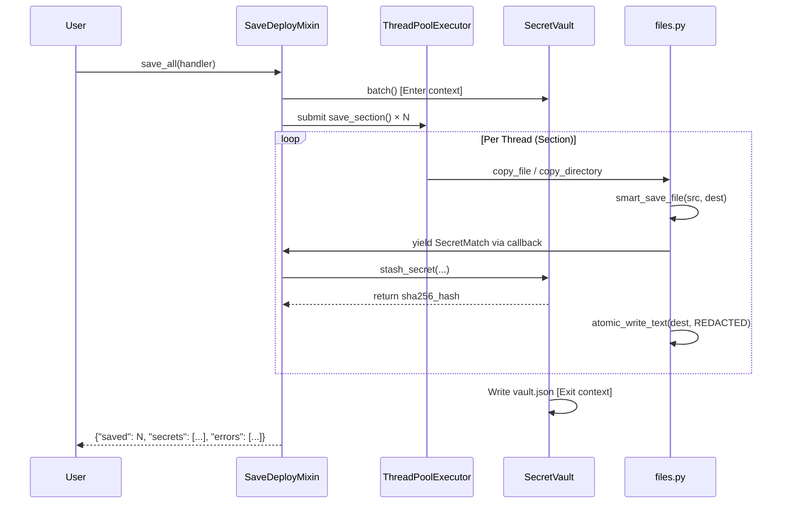

# Core System — Deep Explanation (Extended)
> **Phase 3 of the dot-man Development Guide Manual**  
> Source of truth: `dot_man/` core modules.

---

## Table of Contents

1. [Operations Layer (`operations.py`, Mixins)](#1-operations-layer)
   - [Singleton Pattern Details](#singleton-pattern-details)
   - [SaveDeployMixin Workflow](#savedeploymixin-workflow)
   - [BranchMixin Orchestration](#branchmixin-orchestration)
   - [StatusMixin Diagnostics](#statusmixin-diagnostics)
2. [File I/O & Caching (`files.py`)](#2-file-io--caching)
   - [The `smart_save_file` Primitive](#the-smart_save_file-primitive)
   - [Comparison Cache Internals](#comparison-cache-internals)
3. [Security & Vault (`secrets.py`, `vault.py`)](#3-security--vault)
   - [Secret Scanning Pipeline](#secret-scanning-pipeline)
   - [Vault Storage & Cryptography](#vault-storage--cryptography)
4. [Git Abstraction (`core.py`)](#4-git-abstraction)
5. [Concurrency & Locking (`lock.py`)](#5-concurrency--locking)
6. [Backups (`backups.py`)](#6-backups)

---

## 1. Operations Layer

The `DotManOperations` class is the central orchestrator of dot-man. All high-level business logic is executed here.

### Singleton Pattern Details

```python
_operations: Optional[DotManOperations] = None

def get_operations() -> DotManOperations:
    global _operations
    if _operations is None:
        _operations = DotManOperations()
    return _operations
```
**Why a Singleton?**
- **State consistency**: During complex operations like `switch`, multiple files and modules need to query configuration. Reloading TOML files repeatedly would incur significant disk I/O.
- **Cache validity**: The `_operations` instance maintains lazy references to `GlobalConfig`, `DotManConfig`, and `SecretVault`. Once loaded, they remain in memory for the duration of the CLI command.

To force a reset (e.g., after `dot-man init` changes the fundamental directory structure), `reset_operations()` is called to set `_operations = None`.

### SaveDeployMixin Workflow

This mixin handles all data transit between the system and the repository.

#### Save Operation Deep Dive
Signature: `save_all(secret_handler: Callable) -> dict`



**Key mechanisms in `save_section(section, secret_handler)`**:
- It iterates over all `section.paths`.
- Determines the target path in the repo using `section.get_repo_path()`.
- Wraps the user-provided `secret_handler` with a lambda that takes a `SecretMatch`, passes it to the handler, and if the handler decides to `"REDACT"`, calls `vault.stash_secret()` to generate the hash, returning `***REDACTED:hash***` to the file writer.

#### Deploy Operation Deep Dive
Deployment uses a strict two-phase approach to separate read-only scanning from destructive writing.

**Phase 1: `scan_deployable_changes(sections) -> dict`**
Iterates over every file in the requested sections.
- For each file, it uses `compare_files(repo_path, local_path)`.
- If the files differ, it appends the `(section, local_path, repo_path)` tuple to `sections_to_deploy`.
- Simultaneously, it deduplicates `pre_deploy` and `post_deploy` shell hooks defined on those sections.
- **Returns**: `{"sections_to_deploy": [...], "pre_hooks": [...], "post_hooks": [...], "errors": [...]}`

**Phase 2: `execute_deployment_plan(plan) -> dict`**
Iterates over `sections_to_deploy` using a `ThreadPoolExecutor`.
- Copies `repo_path` to `local_path`.
- Calls `vault.restore_secrets_in_content(content, branch)` to turn hashes back into plain-text secrets.
- Writes to disk using `atomic_write_text()`.

### BranchMixin Orchestration

`switch_branch(target_branch, save_mode, dry_run, force)` orchestrates the entire context switch.

1. **Pre-check**: Abort if already on `target_branch`.
2. **Phase 1: Save State**:
   - If `save_mode == "save"`, calls `save_all()`.
   - Commits the saved files to the current branch via `git.commit("Auto-save from ...")`.
3. **Phase 2: Git Checkout**:
   - Checks if `target_branch` exists via `git.branch_exists()`.
   - Calls `git.checkout(target_branch, create=not_exists)`.
   - **Crucial step**: Calls `ops.reload_config()`. The git checkout physically replaced `~/.config/dot-man/repo/dot-man.toml` with the version from `target_branch`. The `DotManConfig` object in memory must be discarded.
4. **Phase 3: Deploy State**:
   - Collects hooks and runs `pre_deploy`.
   - Calls `deploy_all()`.
   - Runs `post_deploy`.
   - Updates `global_config.current_branch = target_branch`.

### StatusMixin Diagnostics

- **`get_detailed_status() -> Generator`**: Yields dictionaries of `{section, local_path, repo_path, status}`. Status is calculated efficiently using `compare_files()`. `NEW` (local exists, repo doesn't), `MODIFIED` (both exist, differ), `IDENTICAL` (both exist, identical), `DELETED` (repo exists, local doesn't).
- **`audit()`**: Reads all tracked local files and passes them through `SecretScanner`. Yields raw `SecretMatch` objects for reporting. Does not modify files.

---

## 2. File I/O & Caching

The `files.py` module handles all file system interactions safely.

### The `smart_save_file` Primitive
Signature: `smart_save_file(src: Path, dest: Path, filter_secrets_enabled: bool, secret_callback: Callable)`

This is the lowest-level copy operation in dot-man.
1. It reads `src` as bytes.
2. It attempts to decode it as UTF-8. If it fails (e.g., it's a `.png` or compiled binary), it skips to step 4 with `is_binary = True`.
3. If it's text, and `filter_secrets_enabled` is True, it calls `filter_secrets()`.
4. It reads `dest` (if it exists) and compares the filtered content to `dest`'s content.
5. If they are identical, it does nothing and returns `(False, [])`.
6. If they differ, it writes the new content to `dest` using `atomic_write_text()`.

### Comparison Cache Internals
```python
_comparison_cache: dict[str, tuple[float, int, float, int, bool]] = {}
```
The `compare_files(f1, f2)` function is heavily optimized:
1. Calls `os.stat` on both files.
2. Compares sizes. If different, returns `False` immediately.
3. Checks `_comparison_cache` using `"path1|path2"`.
4. If the cached mtimes and sizes match the current `os.stat` results, it returns the cached boolean result.
5. If cache miss, it calls `filecmp.cmp(f1, f2, shallow=False)` and stores the result in the cache.

The cache is invalidated entirely by `clear_comparison_cache()` after any operation that writes to disk (`deploy_all`, `save_all`, `revert_file`).

---

## 3. Security & Vault

### Secret Scanning Pipeline

`SecretPattern` (defined in `secrets.py`) uses compiled regexes. 

```python
@dataclass
class SecretMatch:
    file_path: str
    line_number: int
    line_content: str
    matched_text: str
    pattern_name: str
    severity: Severity
```

The function `filter_secrets(content, callback)` iterates through the file string line by line. When a pattern matches, it invokes `callback(match)`. Based on the callback's string return value, the string is either kept intact, or the match is `.replace()`'d with the redaction string.

### Vault Storage & Cryptography

**Encryption**:
dot-man uses the `cryptography` package's `Fernet` module. This is a symmetric encryption algorithm (AES 128-bit in CBC mode, with PKCS7 padding and an HMAC using SHA256).
- Key file: `~/.config/dot-man/.key`
- Data file: `~/.config/dot-man/vault.json`

**Vault JSON Structure**:
```json
{
  "secrets": [
    {
      "file_path": "~/.gitconfig",
      "line_number": 5,
      "pattern_name": "Generic API Key",
      "secret_hash": "e3b0c44298fc1c149afbf4c8996fb92427ae41e4649b934ca495991b7852b855",
      "encrypted_value": "gAAAAABkYx...",
      "branch": "work",
      "added_at": "2026-05-13T00:00:00"
    }
  ]
}
```

**Why store `secret_hash`?**
When the repository contains `api_key = "***REDACTED:e3b0c4...***"`, the `deploy` process uses a regex `\*\*\*REDACTED:([a-f0-9]{64})\*\*\*` to extract the hash. It then finds the entry in `vault.json` where `secret_hash == extracted_hash`, decrypts `encrypted_value`, and substitutes the real string back into the file. This makes redaction line-number independent. If you move the API key from line 5 to line 10, the hash-based lookup still succeeds.

---

## 4. Git Abstraction

`core.py` provides the `GitManager` class.

**Key implementations:**
- `current_branch()`: 
  ```python
  try:
      return self.repo.active_branch.name
  except TypeError:
      return "HEAD"  # Handles detached HEAD states safely
  ```
- `get_file_from_branch(branch, path)`:
  Uses Git's native tree objects to avoid disk I/O.
  ```python
  commit = self.repo.commit(branch)
  tree = commit.tree
  blob = tree / path
  return blob.data_stream.read()
  ```
- `get_all_branch_stats()`:
  Uses `self.repo.git.for_each_ref(...)` to retrieve commit dates and messages for all branches in a single subprocess call, which is exponentially faster than iterating through branches via python objects.

---

## 5. Concurrency & Locking

`lock.py` ensures process-level safety.

```python
class FileLock:
    def __init__(self, lock_file: Path):
        self.lock_file = lock_file
        self.fd = None

    def __enter__(self):
        self.fd = os.open(self.lock_file, os.O_CREAT | os.O_RDWR)
        try:
            # LOCK_EX (exclusive) | LOCK_NB (non-blocking)
            fcntl.flock(self.fd, fcntl.LOCK_EX | fcntl.LOCK_NB)
        except BlockingIOError:
            raise LockError("Another dot-man process is currently running.")
        return self

    def __exit__(self, exc_type, exc_val, exc_tb):
        fcntl.flock(self.fd, fcntl.LOCK_UN)
        os.close(self.fd)
```

Because `fcntl.flock` is tied to the file descriptor and the process, the lock is automatically released by the OS if the Python process crashes or is `SIGKILL`ed. This prevents "stale lock" deadlocks.

---

## 6. Backups

`backups.py` provides `BackupManager`.

`create_backup(name)`:
1. Validates the repo and vault exist.
2. Generates a filename: `dot-man-backup-{name}-{timestamp}.tar.gz`.
3. Uses Python's built-in `tarfile` module to compress the entire `~/.config/dot-man/repo` directory and `~/.config/dot-man/vault.json`.
4. Excludes `.git/objects` caching cruft if requested.

`restore_backup(filename)`:
1. Validates the tar file exists.
2. Removes current repo and vault.
3. Extracts tarball in-place.
4. Forces `reset_operations()` so subsequent operations use the restored data.
